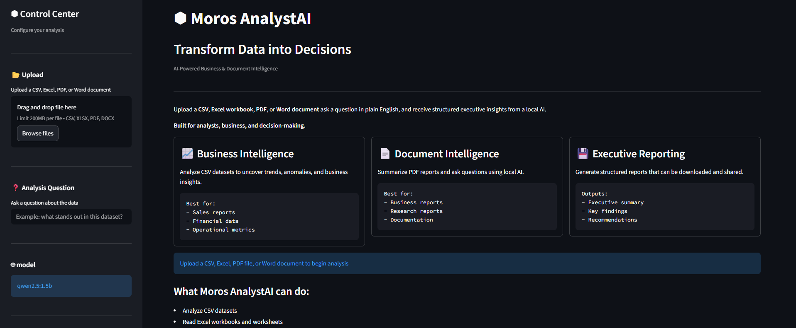
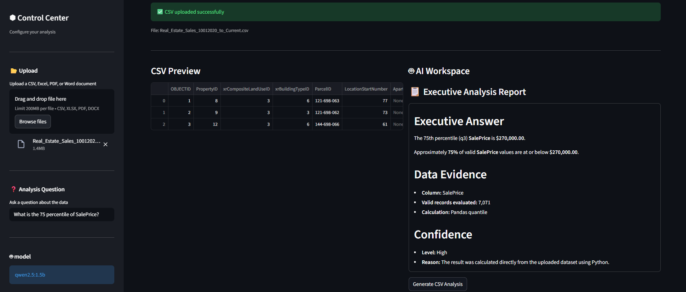
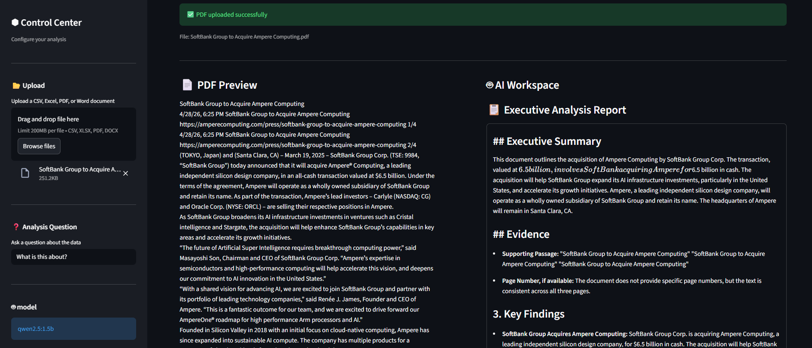

# ⬢ Moros AnalystAI

[](https://github.com/Nero103/analystai/actions/workflows/ci.yml)


**Transform Data into Decisions.**

*AI-Powered Business & Document Intelligence*



Moros AnalystAI is a local AI-powered analytics application for analyzing structured business data and unstructured documents.

It supports **CSV, Excel (.xlsx), PDF, and Word (.docx)** files and allows users to ask questions in natural language, perform deterministic statistical analysis, generate evidence-backed insights, and create downloadable executive-style reports.

The application combines **Python/Pandas calculations with locally hosted large language models through Ollama**, allowing supported quantitative questions to be calculated deterministically while AI is used for interpretation, document analysis, and report generation.

---

## Project Status

**Current Release: v1.0**

Moros AnalystAI is a completed reference implementation and portfolio project.

Active feature development has concluded. Future updates, if any, will focus primarily on maintenance, compatibility, and bug fixes rather than feature expansion.

---

## Features

### Structured Data Analysis

Moros AnalystAI supports structured analysis of:

- CSV files
- Excel (.xlsx) workbooks
- Individual Excel worksheets
- Numeric and categorical business data

Users can:

- Preview uploaded datasets
- Inspect rows, columns, and data types
- Identify missing or unusable values
- Ask natural-language questions about their data
- Generate statistical profiles
- Generate evidence-backed business interpretations
- Download analysis reports

### Deterministic Analytics

Supported quantitative questions are calculated directly with Python and Pandas rather than relying on the language model to estimate or calculate the answer.

Current deterministic analytics include:

- Mean
- Median
- Minimum and maximum
- Quartiles
- Percentiles / quantiles
- Standard deviation
- Variance
- Sum
- Interquartile range (IQR)
- Skewness
- IQR-based outlier detection
- Coefficient of variation
- Pearson correlation
- Covariance
- Missing-value counts
- Valid-record counts
- Value distributions

Numeric profiling also reports information such as data coverage, unusable values, sample size, variability, skewness, and potential outliers where applicable.

### Document Intelligence

Moros AnalystAI supports:

- PDF documents
- Word (.docx) documents

Users can:

- Extract readable document text
- Preview extracted content
- Ask questions about document contents
- Generate executive-style summaries
- Identify key findings
- Surface risks and recommendations
- Generate evidence-backed responses
- Download completed analysis reports

### Local AI Analysis

Moros AnalystAI integrates with **Ollama** to run compatible large language models locally.

The AI layer is used for tasks such as:

- Natural-language interpretation
- Document question answering
- Executive summaries
- Business-focused analysis
- Findings and recommendations
- Structured report generation

The model can be changed through the application's configuration.

### Evidence & Confidence

AnalystAI was designed around a simple principle:

> Use deterministic calculations when the answer can be calculated, and use AI when interpretation is required.

Where supported, responses provide evidence such as:

- Calculated values
- Record counts
- Source passages
- Analysis methodology
- Confidence indicators

This reduces dependence on the language model for calculations that can be performed directly in Python.

### Dashboard

The Streamlit interface includes:

- Dark dashboard interface
- File upload workspace
- Dataset/document preview
- Natural-language question input
- Analysis summary metrics
- Processing-time reporting
- Executive report formatting
- Downloadable text reports

---

## Supported File Types

| Format | Analysis Type | Processing |
| --- | --- | --- |
| CSV | Structured data | Pandas |
| Excel (.xlsx) | Structured data / worksheets | Pandas + openpyxl |
| PDF | Document intelligence | PyPDF |
| Word (.docx) | Document intelligence | python-docx |

---

## How It Works

### Structured Data



1. Upload a CSV or Excel file.
2. AnalystAI loads the dataset using Pandas.
3. Excel workbooks can be analyzed by individual worksheet.
4. The application profiles the dataset and identifies relevant columns.
5. Supported statistical questions are routed to deterministic Python calculations.
6. AI is used where interpretation or broader analysis is appropriate.
7. Evidence and confidence information are included where supported.
8. The completed analysis can be downloaded as a text report.

### Documents



1. Upload a PDF or Word document.
2. AnalystAI extracts readable text from the document.
3. The user asks a natural-language question or requests a summary.
4. Extracted document content is provided to the configured local AI model.
5. AnalystAI generates a structured report using the available document evidence.
6. The completed analysis can be downloaded.

---

## Architecture

Moros AnalystAI separates file processing, deterministic analytics, AI analysis, configuration, and user-interface responsibilities.

Core components include:

- **Streamlit** — application interface
- **Pandas** — structured data processing
- **Python statistical functions** — deterministic calculations
- **Ollama** — local LLM inference
- **PyPDF** — PDF text extraction
- **python-docx** — Word document extraction
- **openpyxl** — Excel workbook support
- **pytest** — automated testing
- **GitHub Actions** — continuous integration

This architecture allows deterministic calculations and generative AI to serve different roles rather than using an LLM for every analytical task.

---

## Tech Stack

- Python
- Streamlit
- Pandas
- NumPy
- Ollama
- Local Large Language Models
- PyPDF
- openpyxl
- python-docx
- pytest
- Git
- GitHub
- GitHub Actions

---

## Testing & Reliability

Moros AnalystAI includes automated testing for its analytics and file-processing functionality.

The test suite covers areas including:

- Deterministic statistical calculations
- Numeric profiling
- Excel workbook loading
- Excel worksheet selection
- Empty worksheets
- Header-only worksheets
- Invalid Excel files
- Invalid worksheet selections
- Word text extraction
- Empty Word documents
- Invalid Word documents

The application also includes safeguards for analytical edge cases such as:

- Constant numeric columns
- All-zero values
- Negative means when calculating coefficient of variation
- Low data coverage
- Small samples
- Dirty or unusable numeric values
- Extreme numeric values

The final v1.0 release passed **28 automated tests** in the local test suite.

GitHub Actions runs automated validation on repository pushes and pull requests.

Run the test suite locally with:

```bash
python -m pytest -v
```

---

## Privacy & Local Processing

Moros AnalystAI is designed to support local AI processing through Ollama.

When configured with a local Ollama model, document and dataset analysis can be performed without sending the analyzed content to a hosted LLM provider.

This architecture may be useful for experimentation with workflows where local processing or greater control over data handling is preferred.

Moros AnalystAI itself does not provide a hosted AI model. Users are responsible for installing Ollama and downloading a compatible model.

---

## Why I Built Moros

I built Moros AnalystAI to explore how Generative AI can complement traditional business analytics and research workflows.

The project began as a simple CSV analyzer but evolved into an experiment in separating two different analytical responsibilities:

**Deterministic computation** for questions that software can calculate reliably, and **Generative AI** for interpretation, document analysis, and natural-language reporting.

That development process expanded the project into a modular application supporting structured datasets and unstructured business documents while incorporating automated testing, continuous integration, evidence reporting, and local AI inference.

---

## Installation & Setup

### 1. Clone the repository

```bash
git clone https://github.com/Nero103/analystai.git
cd analystai
```

### 2. Create a virtual environment

```bash
python -m venv venv
```

### 3. Activate the environment

#### Windows

```bash
venv\Scripts\activate
```

#### macOS / Linux

```bash
source venv/bin/activate
```

### 4. Install dependencies

```bash
pip install -r requirements.txt
```

### 5. Install Ollama

Install Ollama separately and download a compatible local language model.

For example:

```bash
ollama pull qwen2.5:1.5b
```

Ensure the model configured in AnalystAI matches a model installed in Ollama.

### 6. Run AnalystAI

```bash
streamlit run app.py
```

Open the local Streamlit address displayed in the terminal.

---

## Requirements

The application requires:

- Python
- Ollama
- A compatible Ollama language model
- Dependencies listed in `requirements.txt`

Performance and response quality depend on the selected language model and the hardware available to run it.

---

## Limitations

Moros AnalystAI is a local reference implementation rather than a hosted commercial analytics platform.

Current limitations include:

- Ollama must be installed and configured separately.
- Users must download and run a compatible local language model.
- Local model performance depends on available hardware.
- Generative interpretations may still contain errors and should be reviewed before being used for business decisions.
- Deterministic analysis supports a defined set of statistical intents rather than arbitrary statistical procedures.
- Document analysis depends on extractable text and may not capture information contained only in images or complex visual layouts.
- The application does not provide collaborative cloud workspaces, enterprise authentication, or managed model infrastructure.

---

## v1.0 Scope

The completed v1.0 release includes:

- ✅ CSV analysis
- ✅ Excel (.xlsx) analysis
- ✅ Multi-sheet Excel support
- ✅ PDF analysis
- ✅ Word (.docx) analysis
- ✅ Natural-language questions
- ✅ Deterministic statistical analysis
- ✅ Evidence-backed responses
- ✅ Confidence reporting
- ✅ Executive-style reporting
- ✅ Downloadable reports
- ✅ Local Ollama integration
- ✅ Automated pytest suite
- ✅ GitHub Actions CI
- ✅ Input and edge-case handling

---

## Author

Moros AnalystAI was built by **[Nero103](https://github.com/Nero103)** as a portfolio and reference project exploring local AI, business analytics, deterministic computation, and analyst automation.

If you reuse or build upon this project, please provide appropriate credit.